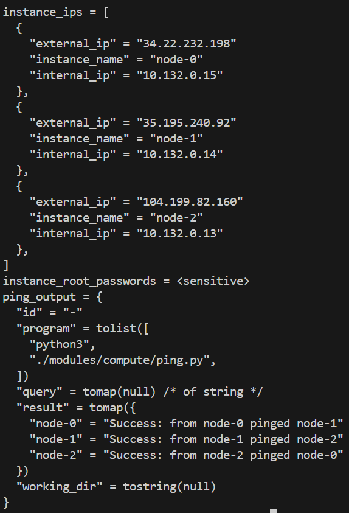

# TF Assessment

## Project Structure
```shell
tf-assessment/
│
├── modules/                  # Directory for Terraform modules
│   ├── compute/              # Module for compute resources (VM instances, autoscaling groups)
│   │   ├── main.tf           # Main file for compute module resources
│   │   ├── variables.tf      # Variables for compute module
│   │   ├── outputs.tf        # Outputs for compute module
│   │   └── ping.py           # Python script for ping task
│   ├── network/              # Module for network resources (VPC, subnets, etc.)
│   └── storage/              # Module for storage resources (buckets, databases)
│
├── main.tf                   # Main Terraform configuration file for global settings
├── variables.tf              # Global variables definition file
├── outputs.tf                # Global outputs definition file
└── terraform.tfstate         # Terraform state file (typically ignored in .gitignore for remote state)

```

## Run
```shell
terraform plan
terraform apply
```

## Output

